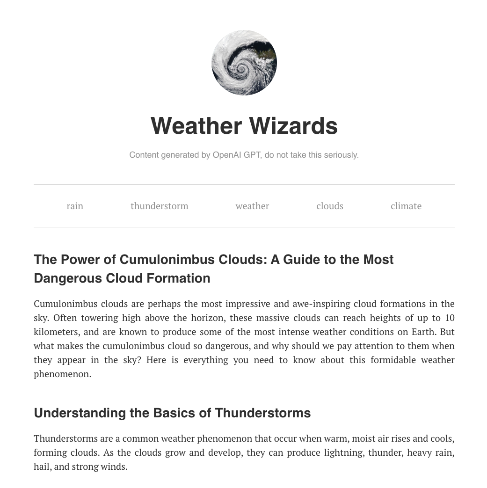

#  Weather Wizzards Blog    

## :small_orange_diamond: About project:
I've created a cool blog for weather enthusiasts using a headless CMS called Prismic. 

Prismic is a headless CMS tool that enables you to create, edit, and publish content without the need to touch your website's code. It works as an independent backend that stores the content and allows its distribution across various channels. In other words, with Prismic, I could have focus on creating and managing content, while leaving the technical aspects of content delivery to the CMS.

To make things even better, I've used OpenAI's chatgpt to generate the blog posts, which are fetched via API. And of course, I've made sure to set up user-friendly URLs to provide a great user experience!




 
## Built with:


**React / API and Fetch / Prismic** 
 
## :cd: How to run a project:

### Prerequisites:

* npm 

  ```sh
  npm install npm@latest -g
  ```

### Installation
This is an example of how you may give instructions on setting up your project locally.
To get a local copy up and running follow these simple example steps.
At first install all dependencies:
```sh
npm install
```


1. Clone the repo
   ```sh
   git clone https://github.com/AgnieszkaSzostak/Weather-Wizards-Blog.git
   ```
2. Install NPM packages
   ```sh
   npm install
   ```
4.  Enter
   ```sh
   npm start
   ```

 
 Project runs at port 3000.


## Credits:
[](https://www.linkedin.com/in/agnieszkaszostak/)
